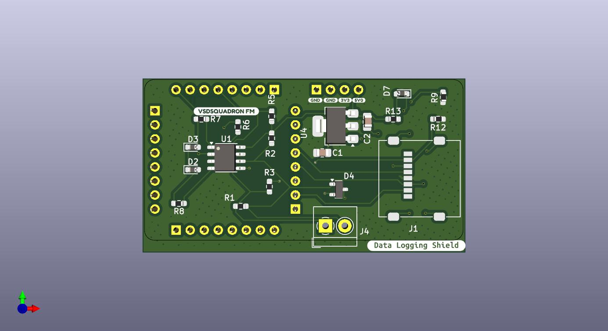
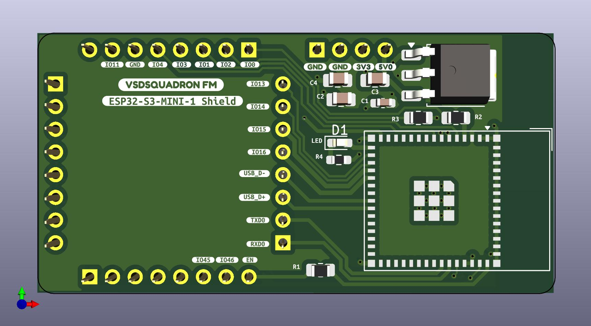
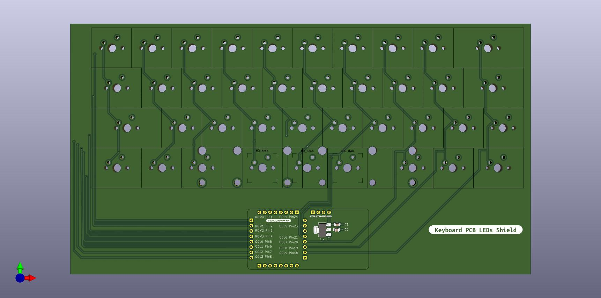
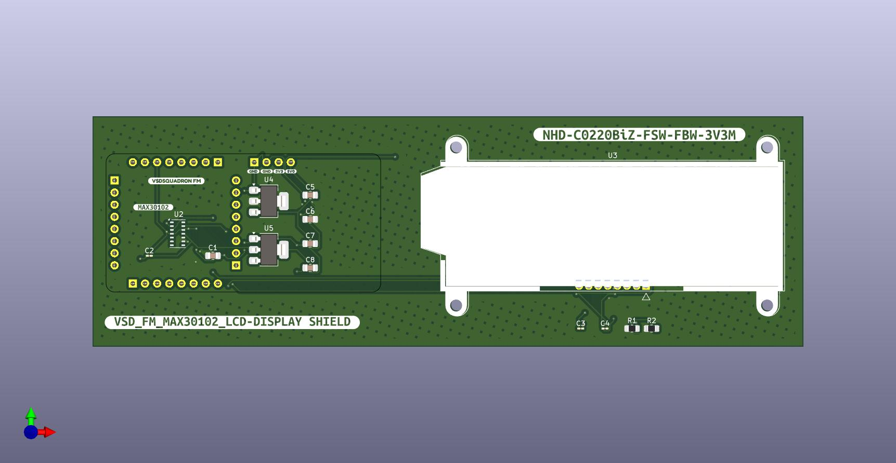
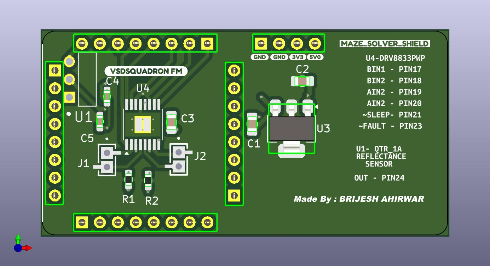
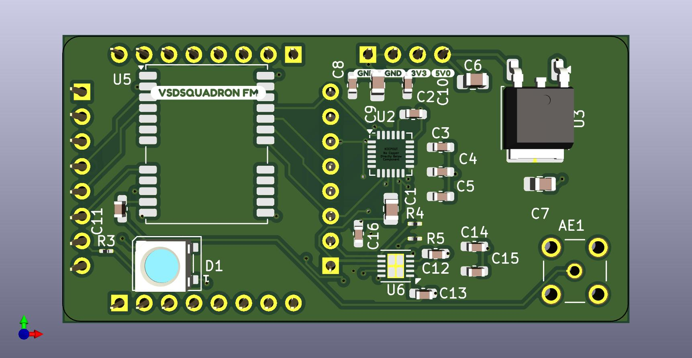
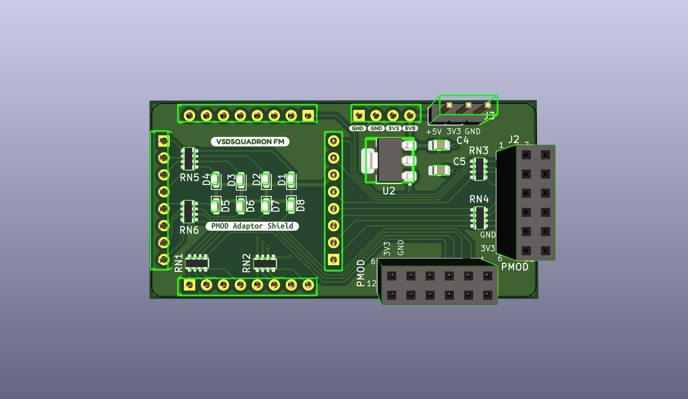

# VSDSquadron FM Shield

This repository is a collection of shields created by the community for VSDSquadron FM. Each shield in this collection serves a unique purpose and showcases the creativity and technical skills of the community. Contributions are welcome to further enhance this collection!

## Shields Overview

| Shield Name           | Author            |
|-----------------------|-------------------|
| ESP32-S3-MINI-1       | Aaryan Sharma     |
| Keyboard_with_LED     | Bilwa             |
| Maze_Solver_Robot     | Brijesh Ahirwar   |
| Neo8M_GPS             | Nachiketh G       |
| PMOD_Adaptor          | David Brough-Smyth|
| Data_Logger_MicroSD   | Roshan            |
| MAX30102_Lcd_Display  | Harshith Paritala |

# Shields Images

## Data_Logger_MicroSD

## ESP32-S3-MINI-1

## Keyboard_with_LED

## MAX30102_Lcd_Display

## Maze_Solver_Robot

## Neo8M_GPS

## PMOD_Adaptor

