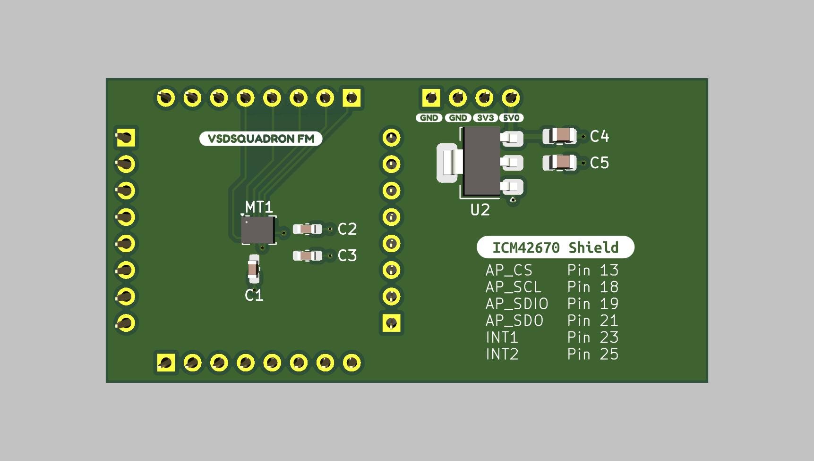

# VSDSquadron FM SHIELD ICM4267

This folder contains the shield for the ICM4267 sensor for the VSDSquadron FM.

## ICM4267 Overview

The ICM4267 is a motion sensor that provides 6-axis sensing with a combination of a 3-axis accelerometer and a 3-axis gyroscope. It is designed to offer high-precision measurement for a variety of applications, including motion tracking and orientation detection.

## Pinout

The following table outlines the pin connections for the ICM4267:

| **Pin Name** | **Pin Number** |
|--------------|----------------|
| AP_CS        | Pin 13         |
| AP_SCL       | Pin 18         |
| AP_SDIO      | Pin 19         |
| AP_SDO       | Pin 21         |
| INT1         | Pin 23         |
| INT2         | Pin 25         |

