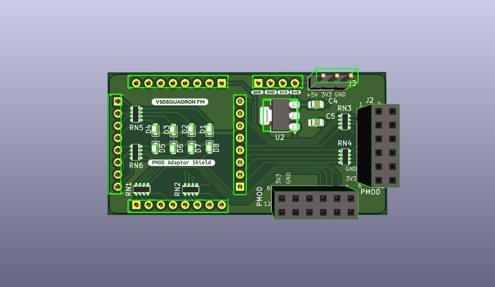
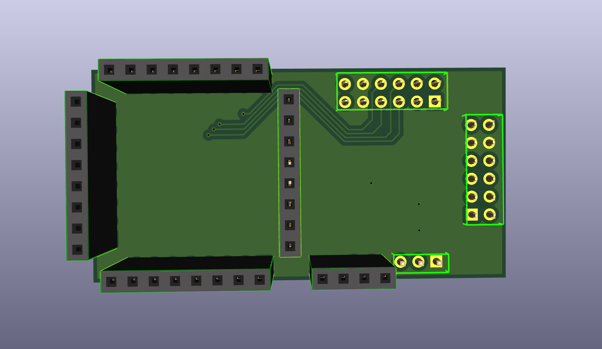

# A PMOD Adaptor shield for the VSDSquadron FM

Contains KiCad files for a shield compatible with the VSDSquadron FM FPGA board.

**Features**
 - 2 PMOD sockets - 2x6pin socket vertical or angled
 - 8 LEDS
 - 1 Low voltage +3.3V regulator
 - 3 pin power header for +5V, +3.3V, GND

**Board Top**

**Board Bottom**

**ICE40UP5K FPGA pinout mapping**

| **Name**   | **VSD FM_Pin** |
|------------|----------------|
| D1         | Pin 38         |
| D2         | Pin 42         |
| D3         | Pin 43         |
| D4         | Pin 44         |
| D5         | Pin 45         |
| D6         | Pin 46         |
| D7         | Pin 47         |
| D8         | Pin 48         |
| PMOD J1 1  | Pin 2          |
| PMOD J1 2  | Pin 4          |
| PMOD J1 3  | Pin 9          |
| PMOD J1 4  | Pin 11         |
| PMOD J1 5  | GND            |
| PMOD J1 6  | +3.3V          |
| PMOD J1 7  | Pin 3          |
| PMOD J1 8  | Pin 6          |
| PMOD J1 9  | Pin 10         |
| PMOD J1 10 | Pin 12         |
| PMOD J1 11 | GND            |
| PMOD J1 12 | +3.3V          |
| PMOD J2 1  | Pin 27         |
| PMOD J2 2  | Pin 25         |
| PMOD J2 3  | Pin 21
| PMOD J2 4  | Pin 18         |
| PMOD J2 5  | GND            |
| PMOD J2 6  | +3.3V          |
| PMOD J2 7  | Pin 26         |
| PMOD J2 8  | Pin 23         |
| PMOD J2 9  | Pin 19         |
| PMOD J2 10 | Pin 13         |
| PMOD J2 11 | GND            |
| PMOD J2 12 | +3.3V          |
